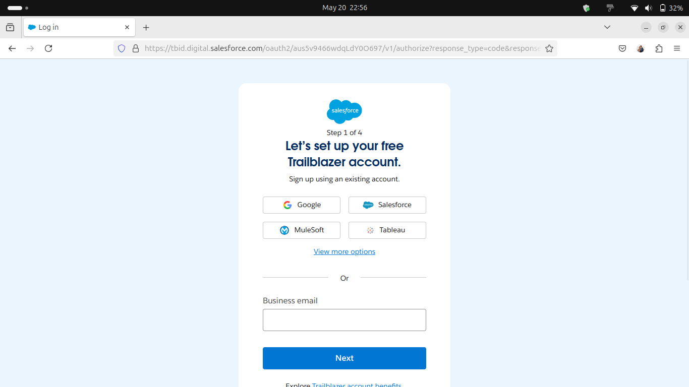
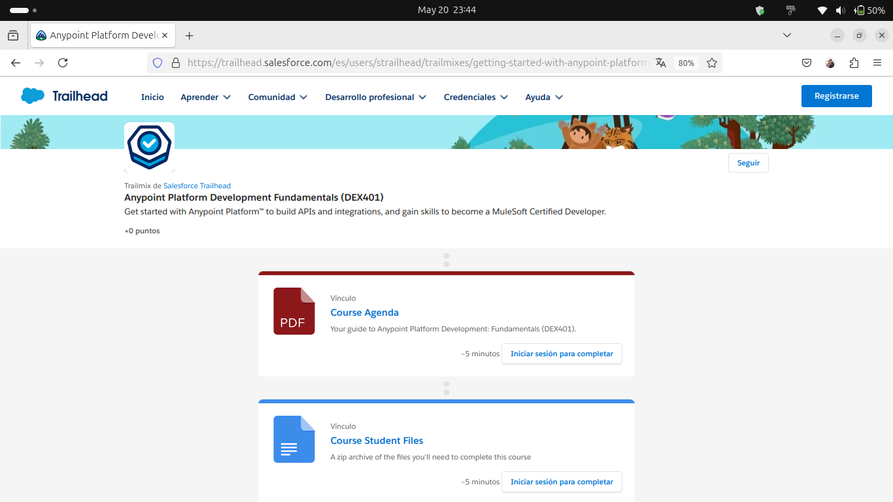
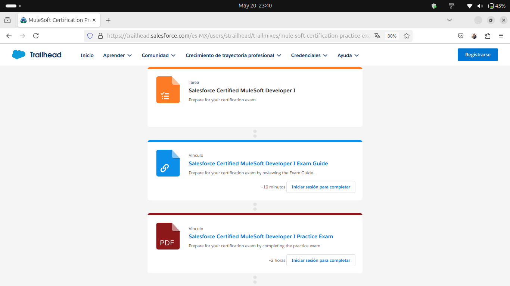

# Guía para Desarrollo con MuleSoft 🏆 
Este repositorio contiene una guía para desarrolladores que desean aprender MuleSoft desde cero. Aquí encontrarás pasos  para registrarte en la plataforma, acceder a cursos clave y utilizar los recursos oficiales para acelerar tu aprendizaje.
 
## Introducción  
Bienvenido/a a la guía de MuleSoft. Aquí aprenderás cómo registrarte y acceder a los recursos esenciales.

## 🚀 Registro en Trailhead  
1. Ir a la plataforma de aprendizaje de Salesforce  [Trailhead](https://trailhead.salesforce.com/es)  
2. Crear una cuenta con el boton Registrar y completa el registro utilizando  tu correo electrónico o una cuenta existente de Google, Salesforce, Mulesoft y Tableu.

## 📚 Recursos para la certificación Mulesoft Developer I  
1. Ingresar al Trailmixes
 [Anypoint Platform Development Fundamentals (DEX401)](https://trailhead.salesforce.com/es/users/strailhead/trailmixes/getting-started-with-anypoint-platform-dex-401) y revisar cada uno de los enlaces para que puedas completar las tareas, como parte de la guía te indicarán los pasos para crear tu cuenta en Anypoint Platform y Salesforce Developer,también como descargar Anypoint Studio para realizar las actividades.

 
## ✍️ Preparación para el examen de certificación Mulesoft Developer I  
1. Ingresar al Trailmixes [MuleSoft Certification Practice Exams](https://trailhead.salesforce.com/es-MX/users/strailhead/trailmixes/mule-soft-certification-practice-exams) para ubicar la tarea "Salesforce Certified MuleSoft Developer I" y revisar los items "Salesforce Certified MuleSoft Developer I Exam Guide" y "Salesforce Certified MuleSoft Developer I Practice Exam".

